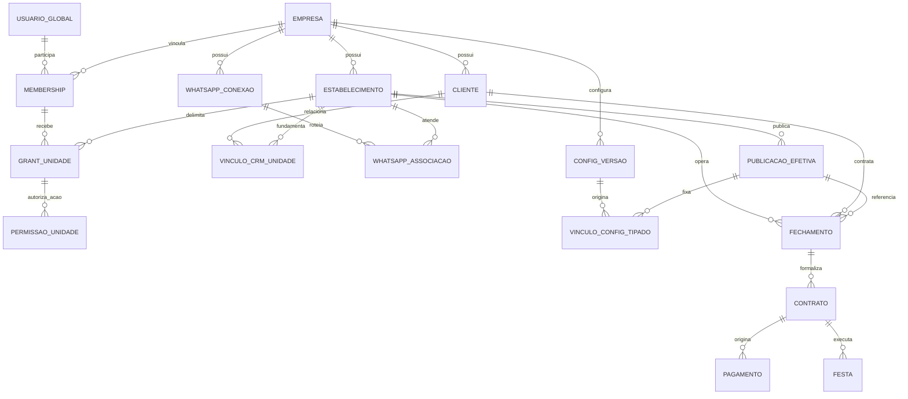

# Blueprint físico proposto — Fundação SaaS

Proposta 1C-A atualizada pela prova1C-B0; [status e OPEN_1C](README.md). Vocabulário: **E** = `empresa_id uuid`; **U** = `estabelecimento_id uuid`; **NN** = NOT NULL final. Tipos/tuplas abaixo são notação de design, não SQL executável. Direção de configuração OPEN01 aprovada; nomes finais e DDL serão revisados em fase posterior.

A [prova B0](SAAS-MIGRATABILITY-PROOF.md) é complemento obrigatório: projeção histórica P precede expansão em adicionais hashados; protocolo M trata guards015/019/imutáveis e timestamps sem reescrever conteúdo. Nenhum sidecar foi comprovado necessário. A [B1](SAAS-LEGACY-SECURITY-DISPOSITION.md) fecha o desenho OPEN03 com autoridade única via X, não por simples cópia para Core; OPEN02 é DESIGN_CLOSED_EXECUTION_GATE. Execução e exceção X ainda exigem aprovação/ensaio.

## Entidades novas estritamente necessárias

Todos os novos IDs técnicos e referências *_id são UUID imutáveis; instantes são timestamptz. Códigos, nomes, status, escopo, tipos, descrição, ação e resultado são text com checks enumerados quando indicados; revisões/números são bigint positivos; metadados de auditoria são jsonb com allowlist e limite de tamanho, nunca envelope arbitrário do request. Identificadores de empresa/unidade não têm DEFAULT Kidmais. Metadados de criação/alteração são NN; revogação/desativação preserva linhas e autoria. FKs de histórico usam RESTRICT/NO ACTION; não propagar DELETE/UPDATE de identidade por cascata. Eventos de mudança de acesso são append-only no canal apropriado de auditoria.

| Entidade proposta | Colunas mínimas e nulabilidade | Chaves, checks e índices | Finalidade, lifecycle e auditoria |
| --- | --- | --- | --- |
| empresas | id NN PK; codigo text NN; nome text NN; razao_social text opcional; identificador_fiscal text opcional; status text NN; criado_em/atualizado_em NN; desativado_em opcional | codigo canônico único global, não vazio; status PROVISIONAMENTO/ATIVA/SUSPENSA/DESATIVADA; desativado_em coerente com estado; PK cobre FKs | Tenant/control plane. Suspensão impede operação nova sem apagar histórico; leitura histórica somente com política de ação específica. Não reutilizar código/id. Plano/faturamento SaaS são extensão futura separada, não configuração comercial na empresa |
| estabelecimentos | id NN PK; E NN; codigo/nome/status NN; criado_em/atualizado_em NN; desativado_em opcional | FK E→empresas; UNIQUE(E,id); UNIQUE(E,codigo); código normalizado; status ATIVO/SUSPENSO/DESATIVADO | Exatamente uma empresa. Código por empresa permite códigos iguais em tenants diferentes. Endereço/contato/identidade publicados como configuração versionada; dados históricos comerciais não dependem do nome atual |
| memberships | id NN PK; E NN; usuario_id uuid NN; status NN; vigente_desde NN; vigente_ate/revogado_em opcionais; criado_em/atualizado_em NN; revisao bigint NN | FK usuário global; FK E; UNIQUE(E,id), UNIQUE(E,usuario_id), UNIQUE(E,id,usuario_id) para onboarding; índice(usuario_id,E,status); fim>início; status PENDENTE/ATIVA/SUSPENSA/REVOGADA, revogação coerente | Um vínculo durável usuário–empresa; nenhuma permissão implícita. Reativação autorizada gera evento, revisao incrementada e revalidação; jamais recria autoria antiga. D10 não é decidido por revisao |
| membership_estabelecimentos | id NN PK; E/U/membership_id NN; status/vigente_desde/criado_em NN; vigente_ate/revogado_em opcionais | FK(E,membership_id)→memberships; FK(E,U)→estabelecimentos; UNIQUE(E,U,membership_id); UNIQUE(E,U,id); índice(E,membership_id,U) | Concessão explícita de acesso à unidade, uma ou várias linhas. D03: sem wildcard de unidades futuras. Não concede ação por si só; revogação mantém histórico |
| autorizacao_acoes | codigo text PK; escopo text NN; descricao text NN; ativa boolean NN | escopo EMPRESA/ESTABELECIMENTO; UNIQUE(codigo,escopo); catálogo publicado pelo Core, não administrável por tenant | Identificadores de ações e granularidade fixa; eliminar códigos desconhecidos/escopo errado. Não é catálogo comercial |
| membership_permissoes_empresa | E/membership_id/acao_codigo NN; escopo constante EMPRESA; vigente_desde NN; vigente_ate/revogado_em opcionais | PK(E,membership_id,acao_codigo); FK(E,membership_id); FK(acao_codigo,escopo)→autorizacao_acoes; datas coerentes | Ações empresariais explícitas, por exemplo CRM completo ou configuração-default. Nunca converte automaticamente ação empresarial em grant para operações de todas as unidades |
| membership_permissoes_unidade | E/U/membership_id/acao_codigo NN; escopo constante ESTABELECIMENTO; vigente_desde NN; vigente_ate/revogado_em opcionais | PK(E,U,membership_id,acao_codigo); FK(E,U,membership_id)→membership_estabelecimentos; FK(acao_codigo,escopo)→autorizacao_acoes | Ação só existe para unidade concedida da mesma empresa. Presets RBAC do Core expandem em concessões explícitas auditadas; não usar papel textual como bypass |
| cliente_estabelecimento_vinculos | id NN PK; E/U/cliente_id NN; status/criado_em NN; fundamento_tipo NN; fundamento_validacao_id ou fundamento_fechamento_id ou fundamento_auditoria_id; revogado_em opcional | UNIQUE(E,U,cliente_id); FK(E,U); FK(E,cliente_id); exatamente um fundamento conforme tipo, referências tenant-aware e cliente do fundamento igual ao cliente vinculado; índice(E,cliente_id,U) | D11c: vínculo contextual, sem cópia de cliente. Evidência OTP/fluxo próprio ou concessão empresarial auditada, validada no backend; não aceitar texto livre/ID como prova. Vínculo revogado não apaga os eventos |
| whatsapp_conexao_estabelecimentos | id NN PK; E/U/conexao_id NN; status/vigente_desde/criado_em NN; vigente_ate/revogado_em opcionais | FK(E,conexao_id)→whatsapp_conexoes; FK(E,U); UNIQUE(E,U,conexao_id); índice(E,conexao_id,U) | Associação de roteamento da conexão da empresa, sem credenciais, sem grant de usuário. Permite várias conexões e várias unidades; seleção efetiva precisa de finalidade/vínculo inequívoco |
| whatsapp_onboarding_unidades | E/U/tentativa_id NN; criado_em NN | PK(E,tentativa_id,U); FK(E,tentativa_id)→whatsapp_onboarding_tentativas; FK(E,U) | Unidades candidatas autorizadas antes do OAuth. Não é associação ativa nem autorização permanente; callback revalida direitos |
| auditoria_seguranca_core | id NN PK; ocorrência e registro distintos; modalidade/tipo/resultado/origem/ator_categoria tipados; autoria humana/serviço comprovada condicional obrigatória; política/classificador/reter_ate NN; extração conforme B1 | FK usuário Core RESTRICT quando humano, principal_servico_codigo tipado quando SISTEMA; sem FK cliente/recurso/payload JSON; correlação request opcional; localizador pseudônimo único; índices de retenção/ocorrência | Entidade SaaS proposta fora das63; emissão global nova e mínimo histórico comprovado via X, sem tenant UNKNOWN. Autoria restrita à role segurança, não diretório. Conteúdo/autoridade/retenção e gates B1; aprovação não implícita |

Essas entidades não são novas entradas na matriz V1 de 63. Publicações e vínculos de configuração estritamente necessários à alternativa recomendada são detalhados no [desenho de configuração](SAAS-CONFIG-PHYSICAL-DESIGN.md). Não criar tabelas de identidade global de clientes, planos comerciais SaaS, filas, suporte delegado ou estoque nesta fundação.

### Escopo e auditoria das concessões

Grant só é efetivo se usuário, empresa, membership, unidade, concessão de unidade e ação estão ativos e dentro da vigência. A suspensão/revogação de um nível superior desabilita o efeito dos filhos, sem precisar destruí-los. Registrar concedente, motivo aprovado, instante, alvo autorizado e correlação em evento empresarial; FKs do concedente não provam sua permissão. Escrita de grants exige ação de delegação e comprovação de que não excede os poderes do concedente. Nenhuma das quatro relações de membership é inserida automaticamente a partir de um papel global.

Membership/grant de unidade e associação WhatsApp usam status ATIVA/SUSPENSA/REVOGADA (membership também admite PENDENTE); vínculo CRM usa ATIVO/REVOGADO. Datas de fim/revogação não podem anteceder início/criação; REVOGADA exige instante de revogação, e grant efetivo exige ausência de revogação. Reativação autorizada atualiza a mesma linha durável, não cria segunda linha que viole unique; cada ciclo fica no evento append-only. Novas permissões e associações exigem concessão expressa, sem expansão por reativar a empresa.

RBAC mínimo recomendado: catálogo de ações Core e concessões normalizadas; presets de papéis são conjuntos de ações versionados na aplicação Core, sem tabela de papéis customizáveis até requisito aprovado. Assim não há coluna role que libere dados por nome. Reativação de membership preserva registro e trilha, mas demanda revisão explícita de concessões que devem voltar a valer; não reativar todos os filhos silenciosamente. D10 permanece aberta sobre transação já em voo versus revogação.

## Identidade administrativa e CRM

`usuarios_administrativos` mantém UUID, credenciais, unicidades de login e histórico; **não recebe empresa_id de ownership**. `papel` V1 serve apenas ao mapeamento autorizado inicial e à compatibilidade temporária; não rege operação multiempresa. Não é necessária mudança destrutiva nessa tabela para memberships. Sessão global autentica; seleção de tenant não é autorização. `sessao_referencia_id` no onboarding é referência histórica deliberadamente sem FK: uma sessão pode já ter sido eliminada. Preservar esse fato; não impor FK retroativa nem recriar sessão. A prova da sessão viva e do usuário deve ser feita no início/callback do fluxo na transação autorizada; encerramento/expiração da sessão nega conclusão. Isso não transforma a referência histórica em autorização.

Clientes, aniversariantes, responsáveis, duplicidades e mesclagens continuam E-owned. Parent pairs sempre na mesma empresa. D11c depende de ação, vínculo e fluxo comprovado: nem todo aniversariante/responsável de um cliente vinculado precisa ser retornado, nem todo campo CRM fica disponível. Resolução inicial pode operar com prova limitada antes de existir o vínculo, evitando dependência circular; cria vínculo somente após verificação e na transação do fluxo autorizado. Para vincular por fechamento, conferir também o cliente raiz; para OTP, E/U/cliente/finalidade e consumo/expiração; para concessão, verificar evento de ação empresarial autorizado, sem permitir autoemissão pela unidade.

Proposta tipada de fundamento CRM: CHECK com exatamente uma referência para fundamento_tipo VALIDACAO, FECHAMENTO ou CONCESSAO_EMPRESARIAL. Para os dois primeiros, UNIQUE(E,U,id,cliente_id) nos pais e FK(E,U,fundamento_id,cliente_id) correspondente; para concessão, UNIQUE(E,id,cliente_id) no evento empresarial e FK(E,fundamento_auditoria_id,cliente_id), com cliente obrigatório nesse tipo de evento. Validador de banco na criação do vínculo exige tipo/resultado da concessão e U-alvo comprovada, ou prova consumida/finalidade autorizada; mera existência de linha de auditoria não concede acesso. O registro-fundamento não pode ser alterado para trocar o cliente/escopo após uso.

Histórico CRM privado de U2 exige unidade de origem e autorização U2, mesmo que o cliente já tenha vínculo U1. Propor `contexto_origem` EMPRESA/ESTABELECIMENTO e U obrigatório no segundo caso em eventos_historico_cliente e auditoria. Evento empresarial exige permissão empresarial correspondente, não wildcard. Não confundir vínculo CRM com permissão de contratos/pagamentos/Festa.

D11b continua CAN_DEFER: futura identidade do titular poderá ter associação opt-in para `(E,cliente_id)` preservando PKs, CPF empresarial e FKs atuais. Ausência de vínculo global não altera o fluxo; não se cria coluna obrigatória, unicidade global de CPF ou lookup cross-company agora.

## WhatsApp e onboarding

Conexão recebe E NN final, UNIQUE(E,id) e continua guardando sua revisão/segredo cifrado; a associação nunca replica o segredo. O UNIQUE global de ambiente CONFIGURADA da018 não comporta a cardinalidade D05: substituir por identidade de conta/número dentro de E/ambiente, preservando validação de status e impedindo duplicação da mesma conexão no escopo. A prevenção de atribuir o mesmo identificador externo ativo a empresas diferentes deve ser um controle restrito de integração, com prova de posse e erro uniforme; não descobrir outra empresa por mensagem de conflito. Não habilitar reuso cross-company automaticamente.

Nova tentativa recebe E e membership_id NN desde o início, com FK(E,membership_id,usuario_id) para UNIQUE(E,id,usuario_id) de memberships. Adicionar a chave-alvo exigida, sem remover PKs. `sessao_referencia_id` preserva o identificador histórico; revalidar a sessão viva e seu usuário na mesma transação, sem FK retroativa impossível. State hash continua único e imprevisível globalmente. As unidades candidatas são linhas tipadas, não IDs arbitrários em JSON. Callback não troca empresa/usuário/sessão por payload; valida state, status, TTL, sessão, membership e concessões atuais. Tentativa legada encerrada, com E comprovada mas sem membership histórica, pode conservar membership_id NULL como exceção histórica marcada no mapeamento de migração; nunca reabrir/consumir nem permitir essa exceção a novas linhas. E continua NN final. Nova tentativa exige reemissão com membership atual, sem fabricar autorização passada. Casos sem origem E seguem [backfill](SAAS-BACKFILL-PLAN.md)/OPEN_1C-03, nunca atribuição por nome de ambiente. Migration018 permanece intacta.

## Padrões estruturais de FK e índices

**Enforcement físico obrigatório da exceção histórica de onboarding:** no cutover, enumerar e selar o conjunto exato de PKs legadas com membership NULL, E comprovada e estado terminal; validar cobertura antes de fechar writers antigos. CHECK limita NULL a estados terminais; trigger de banco recusa toda INSERT pós-cutover sem membership, inclusive se já vier terminal, e recusa UPDATE que remova membership existente, troque PK/E/usuário ou reabra/consuma uma linha do conjunto legado. A exceção fica restrita a esse conjunto imutável, não a um booleano editável pelo runtime. Se houver marcador/mapa técnico, só migrator pode constituí-lo, nunca ampliar pelo runtime; exigir correspondência com a evidência selada. CHECK de estado sozinho não basta. Validar tentativas de INSERT terminal com NULL, NULL por UPDATE e reabertura; qualquer escape bloqueia S6/S7. Assim a nulabilidade física necessária ao histórico não se converte em bypass para novas tentativas.

| Padrão | Chave-alvo / referência proposta | Integridade e índice |
| --- | --- | --- |
| T — tenant | empresas PK(id); cada E→id | E NN final; índice E integrado a chaves/listas, sem índice redundante se prefixo já suficiente |
| U — unidade | estabelecimentos UNIQUE(E,id); filho(E,U)→(E,id) | Prova E de U; E/U NN para 41 operacionais; índice(E,U) por padrão |
| C — CRM | clientes UNIQUE(E,id); filho(E,cliente_id)→(E,id) | Sem U artificial no cliente; CPF empresarial. Índice(E,cliente_id) quando não coberto |
| P — agregado operacional | Pai UNIQUE(E,U,id); filho(E,U,parent_id)→(E,U,id) | Não substitui FKs compostas de domínio, por exemplo contrato+versão+documento; ampliar cada tupla inteira com E/U, conservar checks/trigger de coerência |
| V — autor global | usuario_id→usuarios_administrativos(id) | Preserva autoria, não demonstra membership histórica ou autorização presente |
| CFG — configuração aplicada | Vínculo tipado UNIQUE(E,U,publicacao_id,config_id), operação com tupla idêntica | Prova aplicabilidade da versão à unidade; fonte default E não exige U fictício; ver desenho físico |

Onde pai tem PK diferente de `id`, usar a PK real com prefixo E/U; exemplo festa_buffet usa festa_id e não inventa id. Criar chaves compostas apenas nos alvos referenciados; o detalhe por tabela está na matriz. Índices de lookup dos filhos acompanham a FK; índices UNIQUE já atendendo o prefixo não são duplicados. Consultas por tempo/status exigirão sufixos próprios medidos posteriormente. UUID global de PK permanece único e é útil à compatibilidade, mas não prova escopo.

FK opcional para parent pode continuar sem parent quando o domínio permite; E/U nunca ficam opcionais por isso. `MATCH SIMPLE` ignora a verificação se um componente for NULL: a janela nullable não prova isolamento. `MATCH FULL` não deve ser aplicado indiscriminadamente a `(E,U,parent_opcional)` porque proibiria ausência legítima do pai. Propor checks explícitos de conjunto de escopo, NN final e FK quando parent presente. Uma FK de mesma unidade também não prova que dois pais pertencem ao mesmo contrato: manter as chaves compostas já existentes e regras de domínio. PostgreSQL exige chave única-alvo adequada e não cria automaticamente índice no lado referente; [referência oficial de constraints](https://www.postgresql.org/docs/18/ddl-constraints.html).

CHECK é para a própria linha; relações entre linhas usam FK/unique e, quando não expressáveis, validação transacional de banco com concorrência especificada. Não propor CHECK que consulte tabela externa. DELETE de pais com histórico é bloqueado; desativação é estado, não exclusão. E/U/parent histórico não são campos livremente editáveis.

## Diagrama lógico

Cardinalidades do diagrama são lógicas, não substituem uniques/status existentes (incluindo uma contratação/Festa ativa quando imposto pela019). Todas as arestas tenant-owned exigem coerência E e, nas operacionais, U. Referência de configuração versionada complementa snapshots/valores; não os reescreve.
